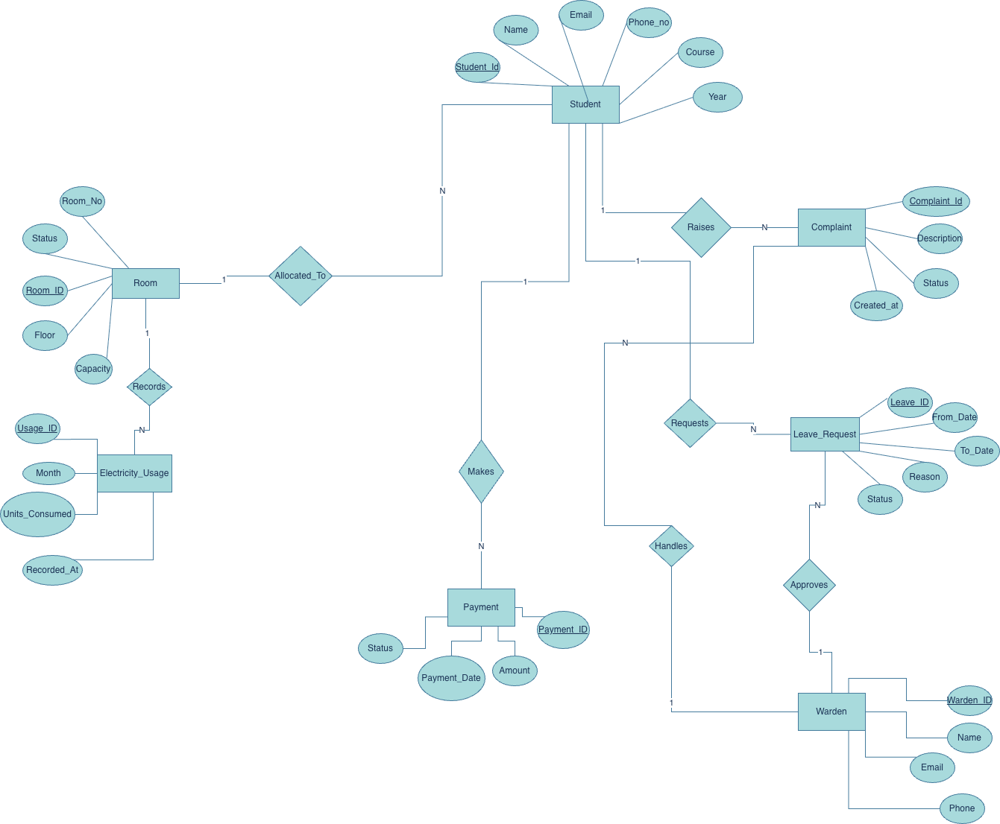

# Smart-Hostel-Resource-Management-System
A system-level full-stack application that optimizes hostel room allocation using scheduling concepts, monitors electricity usage, and streamlines complaint management through secure role-based authentication and real-time data processing.

# User Roles and Permissions

## Admin
The Admin has full control over hostel operations and system management.

Responsibilities:

Manage student records (add, update, remove)
Manage room details
Assign rooms to students
Monitor electricity usage
View and resolve complaints
Track and manage payment records
Manage warden accounts

## Warden
The Warden is responsible for monitoring hostel activities and handling student-related operational tasks.

Responsibilities:

View allocated students
Monitor and update complaint status
Approve or reject leave requests
Update room status

## Student
The Student can access personal and hostel-related information through the system.

Permissions:

View personal profile
View assigned room details
Raise complaints
View payment history
Submit leave requests

# Entity Relationships

##Room and Student

One Room can have up to 2 Students.
One Student belongs to exactly one Room.
Relationship: One-to-Many (Room → Student)

## Student and Complaint

One Student can raise multiple Complaints.
Each Complaint belongs to one Student.
Relationship: One-to-Many

## Student and Payment

One Student can have multiple Payment records.
Each Payment belongs to one Student.
Relationship: One-to-Many

## Student and LeaveRequest

One Student can create multiple Leave Requests.
Each Leave Request belongs to one Student.
Relationship: One-to-Many

## Warden and Complaint

One Warden handles multiple Complaints.
Each Complaint is assigned to one Warden.
Relationship: One-to-Many

## Warden and LeaveRequest

One Warden approves or rejects multiple Leave Requests.
Each Leave Request is processed by one Warden.
Relationship: One-to-Many

## Room and ElectricityUsage

One Room can have multiple Electricity Usage records (monthly basis).
Each Electricity record belongs to one Room.
Relationship: One-to-Many

## ER DIAGRAM

## Relational Schema

Student(student_id PK, name, email, phone, course, year, room_id FK)

Room(room_id PK, room_number, floor, capacity, status)

Complaint(complaint_id PK, student_id FK, warden_id FK, description, status, created_at)

LeaveRequest(leave_id PK, student_id FK, warden_id FK, from_date, to_date, reason, status)

Payment(payment_id PK, student_id FK, amount, payment_date, status)

Warden(warden_id PK, name, email, phone)

ElectricityUsage(usage_id PK, room_id FK, month, units_consumed, recorded_at)
